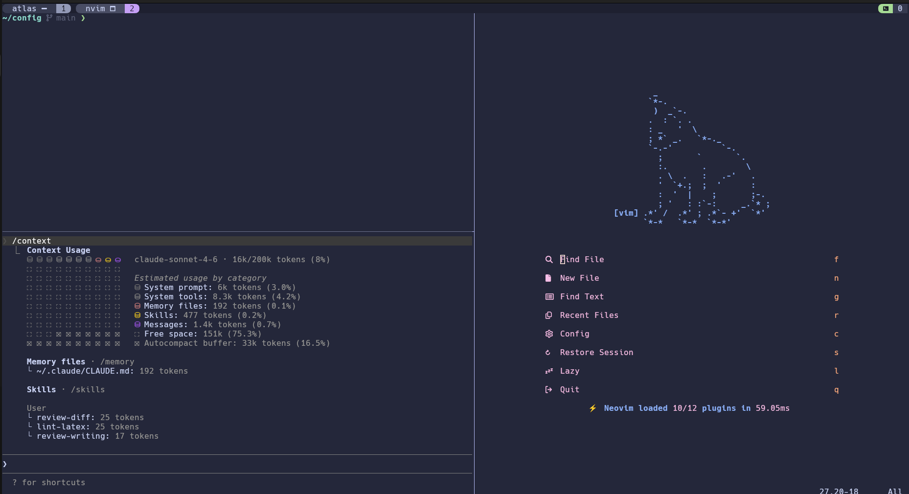

# config

Personal development environment: dotfiles, Ansible automation, and reusable scripts for
Debian-based Linux and WSL.



---

## Install (Linux)

1. Install git and clone the repo:

   ```sh
   sudo apt install git
   git clone https://github.com/liam-od/config.git ~/config
   ```

2. Copy SSH keys to `~/.ssh/` and set permissions:

   ```sh
   chmod 600 ~/.ssh/liam
   chmod 600 ~/.ssh/enki
   ```

3. Install Ansible and run the playbook:

   ```sh
   sudo apt update && sudo apt install pipx
   pipx install ansible-core
   pipx ensurepath
   source ~/.bashrc
   cd ~/config
   ansible-playbook playbook.yml
   ```

   On non-GNOME desktops, skip the system role:

   ```sh
   ansible-playbook playbook.yml --skip-tags system
   ```

4. Switch default shell to zsh, then log out and back in:

   ```sh
   chsh -s $(which zsh)
   ```

5. Fix the git remote to use SSH:

   ```sh
   git remote set-url origin git@github.com:liam-od/config.git
   ```

---

## Install (WSL)

Do these steps on the **Windows** side before running the playbook:

- Install **Hack Nerd Font** on Windows.
- Copy `.wezterm.lua` to `%USERPROFILE%`. WezTerm auto-connects to `WSL:Ubuntu` when launched
  from Windows.
- Use **AutoHotKey** to raise the keyboard repeat rate (Windows caps it below usable levels).

When running the playbook under WSL, skip the roles handled on the Windows side:

```sh
ansible-playbook playbook.yml --skip-tags fonts,system
```

---

## What's included

### Ansible Roles

| Role | Purpose |
|------|---------|
| `base` | Core apt packages: zsh, tmux, ripgrep, fd-find, fzf, eza, texlive-full |
| `tools` | CLI tools: uv, nvm+node, rustup, zoxide, starship, direnv, atuin, neovim, lazygit, claude |
| `fonts` | Hack Nerd Font |
| `symlinks` | Links dotfiles and scripts into `~` and `~/.local/bin` |
| `system` | GNOME keyboard: Caps to Escape, fast key repeat rate |
| `git` | `.gitconfig` + `.gitconfig-enki` from templates (multi-account support) |

---

### Shell, Tmux and WezTerm

WezTerm with zsh, tmux, and the Catppuccin Macchiato theme throughout. Starship prompt, zoxide
smart `cd`, atuin shell history sync, and zsh-autosuggestions.

---

### Neovim

#### Plugins

| Plugin | Function |
|--------|----------|
| `catppuccin/nvim` | Catppuccin Macchiato colour scheme |
| `nvim-lualine/lualine.nvim` | Status bar (mode, branch, diagnostics, LSP status) |
| `folke/snacks.nvim` | Dashboard, fuzzy file/grep picker, file explorer, lazygit, notifications, git browse, indent guides |
| `williamboman/mason.nvim` | LSP/formatter/linter installer |
| `saghen/blink.cmp` | Completion engine |
| `stevearc/conform.nvim` | Format-on-save (stylua, ruff, prettierd, latexindent) |
| `mfussenegger/nvim-lint` | Async linting on save (ruff, chktex) |
| `lewis6991/gitsigns.nvim` | Git hunk signs, staging, blame, diff |
| `nvim-treesitter/nvim-treesitter` | Syntax highlighting and smart indentation |
| `echasnovski/mini.nvim` | AI text objects, surround, auto-pairs, icons |
| `zbirenbaum/copilot.lua` | GitHub Copilot inline suggestions |

#### Keybindings

`<leader>` is `<Space>`.

| Key | Mode | Description | Source |
|-----|------|-------------|--------|
| `zz` | n | Save file | keymaps.lua |
| `<C-c>` | v | Copy to system clipboard | keymaps.lua |
| `<C-h/j/k/l>` | n | Navigate splits | keymaps.lua |
| `<C-w><C-w>` | t | Exit terminal and switch window | keymaps.lua |
| `tn` | n | New tab | keymaps.lua |
| `gd` | n | Go to definition (LSP) | lsp.lua |
| `gr` | n | LSP references (picker) | lsp.lua |
| `<leader>d` | n | Show diagnostics float | lsp.lua |
| `<leader>ff` | n | Find files (project root) | snacks.lua |
| `<leader>fs` | n | Live grep (project root) | snacks.lua |
| `<leader>fF` | n | Find files (home) | snacks.lua |
| `<leader>fS` | n | Live grep (home) | snacks.lua |
| `<leader>e` | n | Toggle file explorer | snacks.lua |
| `<leader>n` | n | Notification history | snacks.lua |
| `<leader>gg` | n | Open lazygit | snacks.lua |
| `<leader>gl` | n | Lazygit log view | snacks.lua |
| `<leader>gB` | n/v | Open file/selection in browser | snacks.lua |
| `<leader>hs` | n | Stage hunk | gitsigns.lua |
| `<leader>hr` | n | Reset hunk | gitsigns.lua |
| `<leader>hi` | n | Preview hunk inline | gitsigns.lua |
| `<leader>hn` | n | Next hunk | gitsigns.lua |
| `<leader>hp` | n | Previous hunk | gitsigns.lua |
| `<leader>gb` | n | Git blame (full) | gitsigns.lua |
| `<leader>gd` | n | Diff against revision (prompt) | gitsigns.lua |
| `<leader>cb` | n | Change git diff base (prompt) | gitsigns.lua |

---

### LaTeX

- `texlive-full` installed via the `base` role
- `texlab` LSP, `latexindent` formatter, `chktex` linter
- `.latexmkrc` and `.chktexrc` dotfiles symlinked

---

### Git

Two gitconfig profiles managed via the `git` role:

- **Personal** - default profile
- **`enki`** - work profile, auto-selected by directory via `includeIf`

---

### Claude Code

Two accounts (personal and work) configured via separate config directories, with shell aliases to
switch between them:

| Alias | Account | Config dir |
|-------|---------|------------|
| `c` | Personal | `~/.claude` (default) |
| `cw` | Work | `~/.claude-work` |

On first run, each alias will prompt you through account login and setup automatically.
