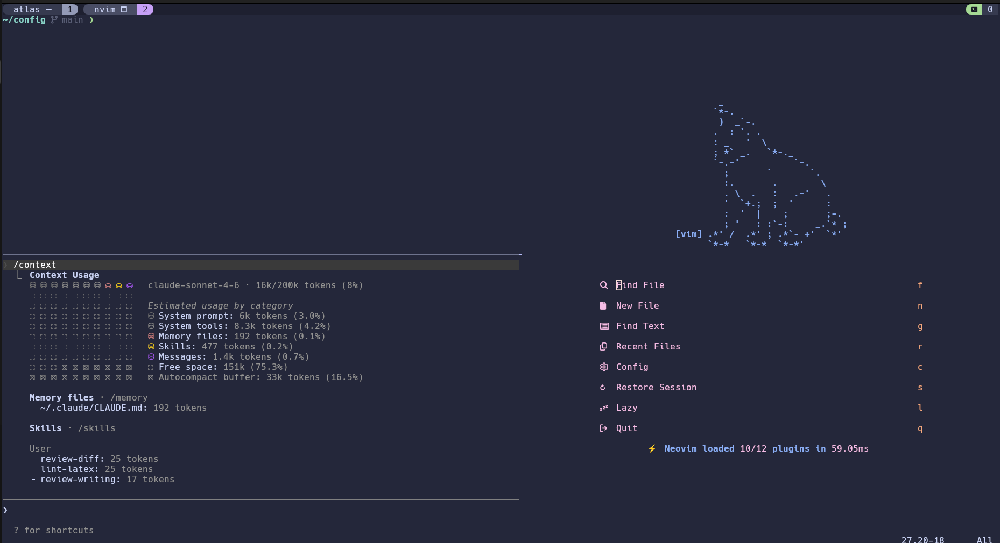
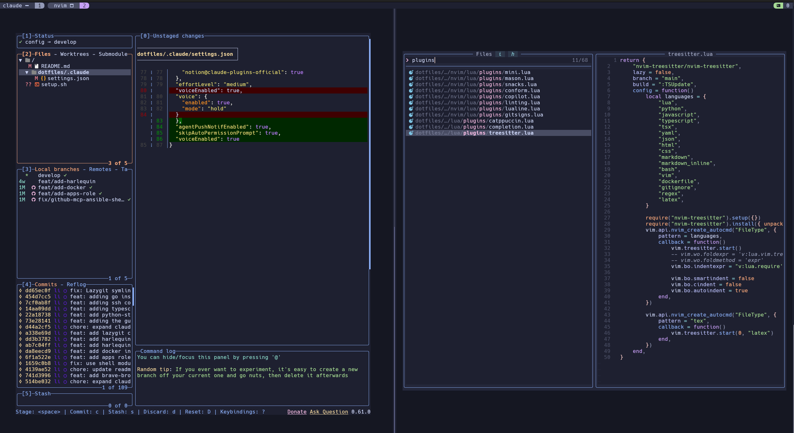

# config

My personal development environment. Dotfiles, Ansible automation, and scripts for Debian-based
Linux and WSL.





---

## Stack

- **Terminal** WezTerm, tmux, zsh
- **Prompt** Starship
- **Editor** Neovim (lazy.nvim)
- **Theme** Catppuccin Macchiato throughout
- **Shell tools** zoxide, atuin, fzf, ripgrep, eza
- **Languages** uv (Python), nvm (Node), rustup (Rust)

---

## Install

### Linux

```sh
sudo apt install git
git clone https://github.com/liam-od/config.git ~/config
cd ~/config && ./setup.sh
```

> If you're me, copy SSH keys to `~/.ssh/` first (permissions must be `600`), then run
> `./setup.sh --me` to include the personal multi-account GitHub config (requires vault password).

Switch to zsh and log out for it to take effect.

```sh
chsh -s $(which zsh)
```

Then open WezTerm and press `Ctrl-a, I` to install tmux plugins, and run `vim` to let lazy.nvim
install Neovim plugins.

### WSL

On the Windows side first:

- Install [**WezTerm nightly**](https://wezterm.org/installation.html) on Windows
- Install **Hack Nerd Font**
- Copy `.wezterm.lua` to `%USERPROFILE%`

```sh
sudo apt install git
git clone https://github.com/liam-od/config.git ~/config
cd ~/config && ./setup.sh --wsl
```

---

## Ansible roles

| Role | What it does |
|------|-------------|
| `base` | Core apt packages (zsh, tmux, ripgrep, fd, fzf, eza, git-delta, jq, gh) |
| `tools` | uv, nvm, rustup, zoxide, starship, direnv, atuin, neovim, lazygit, docker |
| `fonts` | Hack Nerd Font |
| `symlinks` | Links dotfiles into place |
| `system` | GNOME settings, Caps to Escape and fast key repeat |
| `apps` | Spotify (Debian only) |
| `git` | Multi-account GitHub setup (personal, work via `includeIf`) |

---

## Neovim highlights

Full plugin list in [`dotfiles/.config/nvim/lua/plugins/`](dotfiles/.config/nvim/lua/plugins/).

Key plugins are **snacks.nvim** (picker, explorer, dashboard, lazygit), **blink.cmp** (completion),
**conform.nvim** (format on save), **gitsigns.nvim**, and **copilot.lua**.

A few keybinds worth knowing, with `<leader>` as Space.

| Key | Action |
|-----|--------|
| `zz` | Save |
| `<leader>ff` | Find files |
| `<leader>fs` | Live grep |
| `<leader>e` | File explorer |
| `<leader>gg` | Lazygit |
| `<leader>d` | Diagnostics float |

---

## Extra

LaTeX is too large to bundle in the Ansible roles, so install manually if needed.

```sh
sudo apt install texlive-full
```

Eventually planning to migrate the whole setup to [Nix](https://github.com/nixos/nix).
